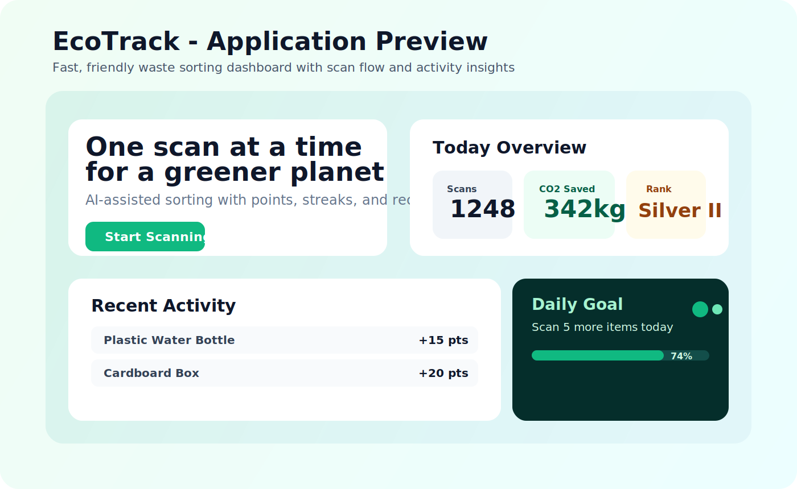

# EcoTrack

EcoTrack is a waste-sorting web application that helps users classify items, learn proper disposal behavior, and build eco-friendly habits through a points and league system.

## Application Picture



## Live Demo

https://dparamet.github.io/Bin-Scan-Better/

## Key Features

- AI-style scan flow for classifying daily waste items.
- Waste category guide for recyclable, organic, general, and hazardous items.
- Gamified progress with points, streaks, and league ranking.
- Activity history and profile management.
- Bilingual interface (English and Thai).

## 5W1H (Clear Project Explanation)

### 1) What

EcoTrack is a front-end focused React application for smart waste sorting and sustainability learning.

### 2) Why

People often struggle to sort waste correctly. This project makes sorting easier, faster, and more engaging so users can reduce landfill waste.

### 3) Who

- End users: students, households, and communities who want better waste habits.
- Developers: teams building eco-tech products with modern web tooling.

### 4) Where

- Runs in any modern browser.
- Local development with Vite.
- Public demo hosted on GitHub Pages.

### 5) When

- Use during daily disposal moments (home, office, school).
- Repeated use over time to improve streaks, points, and user awareness.

### 6) How

- Users scan/select waste items in the app flow.
- The app presents category guidance and sorting feedback.
- Gamification (points, streaks, rank) motivates consistent behavior.
- React + Vite + Tailwind + motion powers a responsive and animated UI.

## Tech Stack

- React 19
- TypeScript
- Vite
- Tailwind CSS
- motion
- Lucide React
- Firebase (Auth + Firestore)

## Getting Started

1. Clone the repository.
2. Install dependencies:

   ```bash
   npm install
   ```

3. Start development server:

   ```bash
   npm run dev
   ```

4. Build for production:

   ```bash
   npm run build
   ```

## Performance Notes

Recent latency-focused updates include:

- Replaced wildcard Lucide icon lookup with an explicit icon map to reduce unnecessary icon bundle usage.
- Added Vite dependency pre-bundling and manual chunk splitting for better caching and faster load paths.
- Removed external web-font request from CSS and switched to a system font stack.
- Added DNS prefetch and preconnect hints for remote image hosts used by the UI.
